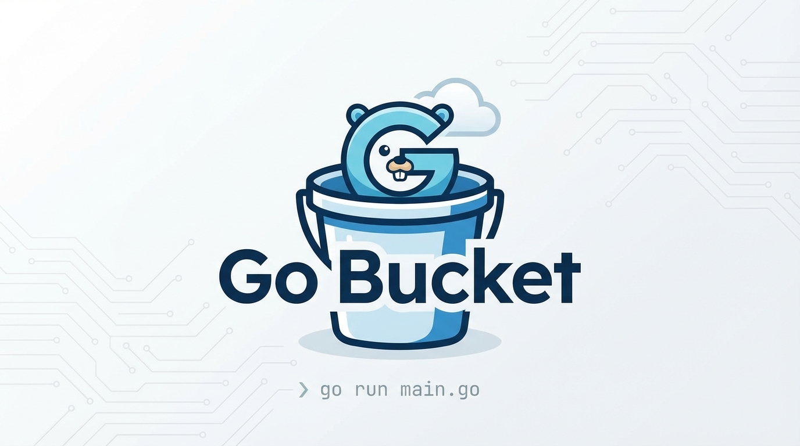

# Go Bucket


A lightweight, open-source file storage server written in Go, inspired by Amazon S3 concepts.

Store, retrieve, delete, and list files via a simple HTTP API — no database required, filesystem only.

## Features

- **Upload files** with API key authentication
  - Multipart form file upload (standard HTML form / curl)
  - Base64-encoded upload (plain base64 or `data:` URI)
  - URL upload (server fetches the file from a remote URL)
  - Raw binary body upload (Ajax `application/octet-stream`)
- **Delete files** with API key authentication (configurable via `ALLOW_DELETE`)
- **List files** with optional prefix filtering and **pagination**
- **File integrity hashes** — MD5 and SHA1 included in upload and list responses
- **Serve files publicly** (no auth required)
- **Path traversal protection** - secure against `../` attacks
- **Streaming file serving** - memory efficient
- **CORS support** - configurable origins
- **Docker ready** - multi-stage build, non-root user

## Quick Start

### Using Docker Hub Image (Recommended)

```bash
# Create storage directory
mkdir -p storage

# Create .env file
echo "STORAGE_API_KEY=your-secret-key-here" > .env

# Run container
docker run -d \
  --name go_bucket \
  -p 8080:8080 \
  -v $(pwd)/storage:/data \
  --env-file .env \
  teguh02/go_bucket:latest

# Check health
curl http://localhost:8080/health
```

### Using Docker Compose

```bash
# Clone and enter directory
cd go_bucket

# Copy environment file
cp .env.example .env

# Edit .env and set your API key
# STORAGE_API_KEY=your-secret-key-here

# Start
docker compose up -d

# Check health
curl http://localhost:8080/health
```

## Docker Compose Examples

### Basic Usage

```yaml
# docker-compose.yml
services:
  go_bucket:
    image: teguh02/go_bucket:latest
    container_name: go_bucket
    ports:
      - "8080:8080"
    volumes:
      - ./storage:/data
    environment:
      - STORAGE_API_KEY=your-secret-key
    restart: unless-stopped
    healthcheck:
      test: ["CMD", "wget", "--no-verbose", "--tries=1", "--spider", "http://localhost:8080/health"]
      interval: 30s
      timeout: 3s
      retries: 3
      start_period: 5s
```

### Production Setup with Custom Domain

```yaml
# docker-compose.prod.yml
services:
  go_bucket:
    image: teguh02/go_bucket:latest
    container_name: go_bucket
    ports:
      - "8080:8080"
    volumes:
      - ./storage:/data
    environment:
      - STORAGE_API_KEY=${STORAGE_API_KEY}
      - PORT=8080
      - MAX_UPLOAD_MB=100
      - ALLOW_OVERWRITE=false
      - ALLOW_DELETE=true
      - CORS_ALLOWED_ORIGINS=https://yourdomain.com
      - PUBLIC_BASE_URL=https://cdn.yourdomain.com
      - CACHE_MAX_AGE=86400
    restart: unless-stopped
    healthcheck:
      test: ["CMD", "wget", "--no-verbose", "--tries=1", "--spider", "http://localhost:8080/health"]
      interval: 30s
      timeout: 3s
      retries: 3
      start_period: 5s
```

### Development Setup (Allow Overwrite, Larger Uploads)

```yaml
# docker-compose.dev.yml
services:
  go_bucket:
    image: teguh02/go_bucket:latest
    container_name: go_bucket_dev
    ports:
      - "8080:8080"
    volumes:
      - ./storage:/data
    environment:
      - STORAGE_API_KEY=dev-key
      - PORT=8080
      - MAX_UPLOAD_MB=500
      - ALLOW_OVERWRITE=true
      - ALLOW_DELETE=true
      - CORS_ALLOWED_ORIGINS=*
      - PUBLIC_BASE_URL=http://localhost:8080
    restart: unless-stopped
```

### With nginx Reverse Proxy

```yaml
# docker-compose.proxy.yml
services:
  nginx:
    image: nginx:latest
    container_name: nginx_proxy
    ports:
      - "80:80"
      - "443:443"
    volumes:
      - ./nginx.conf:/etc/nginx/conf.d/default.conf
      - ./storage:/data
    depends_on:
      - go_bucket
    restart: unless-stopped

  go_bucket:
    image: teguh02/go_bucket:latest
    container_name: go_bucket
    volumes:
      - ./storage:/data
    environment:
      - STORAGE_API_KEY=${STORAGE_API_KEY}
      - PORT=8080
      - PUBLIC_BASE_URL=https://cdn.yourdomain.com
    restart: unless-stopped
```

```nginx
# nginx.conf
upstream go_bucket {
    server go_bucket:8080;
}

server {
    listen 80;
    server_name cdn.yourdomain.com;

    location / {
        proxy_pass http://go_bucket;
        proxy_set_header Host $host;
        proxy_set_header X-Real-IP $remote_addr;
        proxy_set_header X-Forwarded-For $proxy_add_x_forwarded_for;
        proxy_set_header X-Forwarded-Proto $scheme;
    }

    location /files/ {
        proxy_pass http://go_bucket;
        proxy_set_header Host $host;
        add_header Cache-Control "public, max-age=31536000";
    }
}
```

Run with:
```bash
docker compose -f docker-compose.proxy.yml up -d
```

## API Endpoints

### Health Check

```bash
GET /health
```

Response:
```json
{"ok": true, "time": "2024-01-15T10:30:00Z"}
```

---

### Upload File (Auth Required)

```bash
POST /api/upload
```

**Headers:**
- `X-API-Key: your-api-key` OR `Authorization: Bearer your-api-key`

**Form Data:**
- `file` (required): The file to upload — can be a file attachment, a URL string, or a base64-encoded string
- `path` (optional): Destination path, e.g., `avatars/user1.jpg`

The endpoint automatically detects the upload type:

#### 1. Standard multipart file upload (curl / HTML form)

```bash
curl -X POST "http://localhost:8080/api/upload" \
  -H "X-API-Key: your-api-key" \
  -F "file=@./photo.jpg" \
  -F "path=avatars/user1.jpg"
```

#### 2. URL upload (server fetches from remote URL)

```bash
curl -X POST "http://localhost:8080/api/upload" \
  -H "X-API-Key: your-api-key" \
  -F "file=https://placehold.co/600x400.png" \
  -F "path=images/placeholder.png"
```

#### 3. Base64 upload (plain base64 or data URI)

```bash
# Plain base64
curl -X POST "http://localhost:8080/api/upload" \
  -H "X-API-Key: your-api-key" \
  -F "file=SGVsbG8gV29ybGQ=" \
  -F "path=files/hello.txt"

# Data URI
curl -X POST "http://localhost:8080/api/upload" \
  -H "X-API-Key: your-api-key" \
  -F "file=data:text/plain;base64,SGVsbG8gV29ybGQ=" \
  -F "path=files/hello.txt"
```

#### 4. Raw binary body (Ajax / axios / jQuery XHR)

The destination path is supplied via the `?path=` query parameter or the `X-File-Path` header:

```bash
curl -X POST "http://localhost:8080/api/upload?path=images/photo.jpg" \
  -H "X-API-Key: your-api-key" \
  -H "Content-Type: image/jpeg" \
  --data-binary @./photo.jpg
```

JavaScript (axios):
```javascript
const blob = new Blob([fileData], { type: 'image/jpeg' });
await axios.post('http://localhost:8080/api/upload?path=images/photo.jpg', blob, {
  headers: { 'X-API-Key': 'your-api-key', 'Content-Type': 'image/jpeg' }
});
```

#### 5. JSON body (URL or base64)

```bash
# URL via JSON
curl -X POST "http://localhost:8080/api/upload" \
  -H "X-API-Key: your-api-key" \
  -H "Content-Type: application/json" \
  -d '{"file":"https://example.com/doc.pdf","path":"docs/doc.pdf"}'

# Base64 via JSON
curl -X POST "http://localhost:8080/api/upload" \
  -H "X-API-Key: your-api-key" \
  -H "Content-Type: application/json" \
  -d '{"file":"SGVsbG8gV29ybGQ=","path":"files/hello.txt"}'
```

**Response:**
```json
{
  "ok": true,
  "path": "avatars/user1.jpg",
  "url": "http://localhost:8080/files/avatars/user1.jpg",
  "size": 12345,
  "content_type": "image/jpeg",
  "hash": {
    "md5": "d8e8fca2dc0f896fd7cb4cb0031ba249",
    "sha1": "4e1243bd22c66e76c2ba9eddc1f91394e57f9f83"
  }
}
```

---

### Access File (Public)

```bash
GET /files/{path}
```

**Example:**
```bash
curl http://localhost:8080/files/avatars/user1.jpg
```

Direct access in browser:
```
http://localhost:8080/files/avatars/user1.jpg
```

---

### Delete File (Auth Required)

```bash
DELETE /api/files/{path}
```

> Deletion can be disabled globally via the `ALLOW_DELETE=false` environment variable.

**Example:**
```bash
curl -X DELETE "http://localhost:8080/api/files/avatars/user1.jpg" \
  -H "X-API-Key: your-api-key"
```

**Response:**
```json
{"ok": true, "deleted": "avatars/user1.jpg"}
```

---

### List Files (Auth Required)

```bash
GET /api/list?prefix={optional-prefix}&page={page}&per_page={per_page}
```

**Query Parameters:**
| Parameter  | Default | Description |
|------------|---------|-------------|
| `prefix`   | -       | Filter files by folder/prefix |
| `page`     | `1`     | Page number |
| `per_page` | `10`    | Results per page |

**Example:**
```bash
# List all files (page 1, 10 per page)
curl "http://localhost:8080/api/list" \
  -H "X-API-Key: your-api-key"

# Page 2 with 20 per page
curl "http://localhost:8080/api/list?page=2&per_page=20" \
  -H "X-API-Key: your-api-key"

# List files in avatars folder
curl "http://localhost:8080/api/list?prefix=avatars" \
  -H "X-API-Key: your-api-key"
```

**Response:**
```json
{
  "ok": true,
  "files": [
    {
      "path": "avatars/user1.jpg",
      "size": 12345,
      "modified": "2024-01-15T10:30:00Z",
      "hash": {
        "md5": "d8e8fca2dc0f896fd7cb4cb0031ba249",
        "sha1": "4e1243bd22c66e76c2ba9eddc1f91394e57f9f83"
      }
    }
  ],
  "count": 1,
  "page": 1,
  "per_page": 10,
  "total": 1,
  "total_pages": 1
}
```

---

## Environment Variables

| Variable | Required | Default | Description |
|----------|----------|---------|-------------|
| `STORAGE_API_KEY` | Yes | - | API key for upload/delete/list operations |
| `PORT` | No | `8080` | Server port |
| `STORAGE_DIR` | No | `/data` | Storage directory (container path) |
| `PUBLIC_BASE_URL` | No | auto | Base URL for generated file URLs |
| `MAX_UPLOAD_MB` | No | `50` | Maximum upload size in MB |
| `ALLOW_OVERWRITE` | No | `false` | Allow overwriting existing files |
| `ALLOW_DELETE` | No | `true` | Allow deleting files via API |
| `CORS_ALLOWED_ORIGINS` | No | `*` | CORS origins (comma-separated or `*`) |
| `CACHE_MAX_AGE` | No | `31536000` | Cache-Control max-age in seconds |

## Project Structure

```
go_bucket/
├── .github/
│   └── workflows/
│       └── test.yml             # GitHub Actions CI
├── cmd/
│   └── server/
│       └── main.go              # Application entry point
├── internal/
│   ├── config/
│   │   └── config.go            # Configuration loading
│   └── http/
│       ├── handlers.go          # HTTP handlers
│       ├── handlers_test.go     # Unit & integration tests
│       └── middleware.go        # Auth, CORS, logging middleware
├── storage/                      # File storage (mounted volume)
├── .env.example                 # Example environment file
├── .gitignore
├── docker-compose.yml
├── Dockerfile
├── go.mod
└── README.md
```

## Security Features

1. **Path Traversal Protection**: Rejects paths containing `..`, absolute paths, null bytes
2. **API Key Authentication**: Required for upload/delete/list operations
3. **Non-root Docker User**: Container runs as unprivileged user
4. **No Directory Listing**: Returns 404 for directory requests
5. **Atomic File Writes**: Uses temp file + rename for safe writes
6. **Delete Guard**: Deletion can be disabled without removing API access (`ALLOW_DELETE=false`)

## Next.js Integration

**Important:** Never expose the API key in client-side code. Use server-side API routes or server actions.

### Upload from Next.js Server Action

```typescript
// app/actions/upload.ts
'use server'

export async function uploadFile(formData: FormData) {
  const file = formData.get('file') as File
  const path = formData.get('path') as string
  
  const uploadForm = new FormData()
  uploadForm.append('file', file)
  uploadForm.append('path', path)
  
  const response = await fetch(`${process.env.CDN_URL}/api/upload`, {
    method: 'POST',
    headers: {
      'X-API-Key': process.env.CDN_API_KEY!,
    },
    body: uploadForm,
  })
  
  return response.json()
}
```

### Delete from Next.js API Route

```typescript
// app/api/cdn/delete/route.ts
import { NextRequest, NextResponse } from 'next/server'

export async function DELETE(request: NextRequest) {
  const { path } = await request.json()
  
  const response = await fetch(`${process.env.CDN_URL}/api/files/${path}`, {
    method: 'DELETE',
    headers: {
      'X-API-Key': process.env.CDN_API_KEY!,
    },
  })
  
  return NextResponse.json(await response.json())
}
```

## Development

### Run Locally (without Docker)

```bash
# Set environment variables
export STORAGE_API_KEY=dev-key
export STORAGE_DIR=./storage
export PORT=8080

# Run
go run ./cmd/server
```

### Build Binary

```bash
go build -o cdn-server ./cmd/server
./cdn-server
```

### Run Tests

```bash
go test ./... -v -race
```

### Build and Push Docker Image

```bash
# Build
docker build -t teguh02/go_bucket:latest .

# Push to Docker Hub
docker push teguh02/go_bucket:latest
```

## License

MIT
